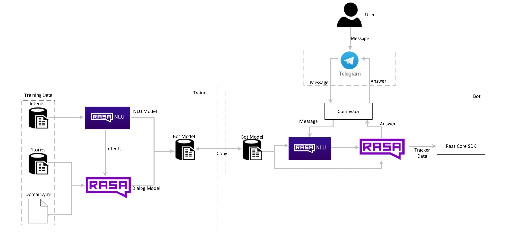

# MARIA - Me Ajuda Rápido com Inteligência Artificial

### Introdução

Um projeto feito em Rasa com a possibilidade para a construção de um projeto grande de chatbot.

Este projeto teve como base o projeto [Tais](http://github.com/lappis-unb/tais).

### Objetivo

A MARIA é uma assitente virtual criada em forma de chatbot e desenvolvida pela equipe de tecnologia da Globo Brasília para auxiliar no cotidiano de diversos setores da emissora, 
provendo respostas rápida para questionamento simples e soluções para pequenos problemas que podem ocorrer ao longo da jornada de trabalho.

### Telegram

Este projeto foi pensado para ser usado com o Telegram como meio de comunicação entre a MARIA e o usúario, principalmente pelas vantagens onde:
*  A API é gratuita;
*  Existe um incentivo ao desenvolvimento de bots pelo Telegram;
*  Funcionalidades como: cards, botões e atalhos, imagens, vídeos.

### RASA

RASA é uma ferramenta que provê uma infraestrutura e as ferramentas necessárias para a criação de assistentes de alta perfomance. 
Foi escolhido essa estrutura por algumas vantagens que apresenta:
*  Build local;
*  Customizável;
*  Fácil migração de outras plataformas;
*  Rasa Core e Rasa NLU para contexto de conversação.

### Entenda a Arquitetura

É utilizado na MARIA diversas tecnologias que interagem entre si para obter um melhor resultado. Veja a arquitetura implementada:

O usuário interage com a MARIA via Telegram, que manda as mensagens para o Rasa NLU através de
conectores, onde ele identifica a *intent*, e responde pelo Rasa Core, de acordo com as *stories* e *actions*.  
As *models* utilizadas para a conversação foram geradas pelo módulo *trainer* e depois transferidas para o bot, estes
modelos podem ser versionados e evoluídos entre bots.  
Os notebooks avaliam o funcionamento de acordo com o formato das *intents* e *stories*.

### Documentação

Para a manutenção e atualização da MARIA, tutoriais e explicações estão disponíveis na [wiki](https://gitlab.com/francocamila/maria_globo/-/wikis/home) do projeto.